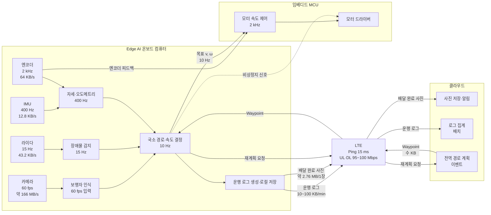

# 모듈 ① 과제 — 배달 로봇 온보딩
> 시스템 설계 감각과 개발 환경 | 범위: 1~4강 

## 과제 소개 
> 로봇 회사의 첫 주는 두 가지로 채워집니다. 하나는 "이 로봇의 어느 계산을 어디서 돌릴지" 를 이해하는 일이고, 다른 하나는 개발환경을 세우고 팀 저장소에 첫 PR을 올리는 일입니다. 이 과제는 배달 로봇을 대상으로 그 두 가지를 그대로 해 봅니다.
> <br><br>
> 로봇도, 온보드 컴퓨터도, USB 센서도 필요하지 않습니다. SSH 는 내 리눅스에 서버를 올려 접속하고, udev 는 리눅스가 기본 제공하는 loop 장치로 진행합니다.
> <br><br>
>이 과제의 범위는 1~4강입니다 — Physical AI 개요와 연산 분담(1강), 로봇 SW 스택과 실시간성(2강), 리눅스와 개발환경(3강), Git 협업(4강). Python·NumPy·ROS2 는 모듈 ② 에서 다루므로 이 과제에 나오지 않습니다.

## 과제 목표 
- 임베디드·Edge AI·클라우드의 연산 분담을 지연 예산과 데이터 전송량을 근거로 판단할 수 있어요.
- 로봇 SW 스택(인지-판단-제어)의 계층별 주기와 실시간성 등급을 구분할 수 있어요.
- Ubuntu CLI와 SSH 원격 접속, udev rules로 디바이스 경로를 고정해 개발환경을 구성할 수 있어요. **(루브릭 채점)**
- Git/GitHub에서 브랜치·merge/rebase·conflict 해결과 PR 리뷰 워크플로우를 수행할 수 있어요. **(루브릭 채점)**
---

## 1. 배달 로봇의 연산 분담과 실시간성 설계 

### 00. 전제 - 로봇 구성과 센서별 데이터량
| 장치 | 갱신 주기 | 1회 데이터(가정) | 데이터율 | 비고 |
|---|---|---|---|---|
| 바퀴 엔코더 | 2 kHz(2 ms) | 4륜 x 4 B x 2 = 32 B | ≈64KB/s | 4개 바퀴의 엔코더 값을 2 kHz로 수집. 모터 속도 제어용으로 MCU에서 로컬 처리 |
| IMU | 400 Hz(2.5 ms) | (가속도 3축 + 각속도 3축) x 4 B + 타임스탬프 8 B = 32 B | 12.8 KB/s | 자세·가속도 추정에 사용. 제어에 필요한 고주기 데이터이므로 Edge/MCU에서 처리 |
| 2D 라이다 | 15 Hz(1/15 ≈0.0666... 이므로, 약 66.7ms) | 360 점 x (거리 4 B + 세기 4 B) = 2,880 B | 43.2 KB/s  | - |
| RGB 카메라 | 60 fps(16.7 ms) | 1280 x 720 x 3 B = 2,764,800 B ≈ 2.76 MB | 약 166 MB/s | 비압축 RGB 기준 |
| LTE 모듈 | 가변 | 가변 | Ping 15 ms <br> UL·DL : 95~100 ms | Cat4 20MHz 채널 대역폭을 기준, 외부 변수가 없는 이상적 조건에서의 이론적 최대속도 |
> #### 지시문에 주어진 센서와 통신 장치를 먼저 숫자로 정리합니다. 이후 모든 배치 판단은 위 표의 데이터를 근거로 한다.
>
> #### 구현 내용에서 데이터 포맷이 명시되지 않은 항목은 데이터량 비교를 위해 가정하였다. 수치형 센서 데이터는 32-bit(4 B)로, IMU는 가속도 3축·자이로 3축과 64-bit(8 B) 타임스탬프로 구성하였다. 엔코더는 바퀴당 32-bit 값 2개, 2D LiDAR는 360점/스캔 및 거리·세기 각 32-bit로 가정하였다. RGB 카메라는 1280×720 RGB 8-bit/channel 비압축 원시 데이터를 기준으로 계산하였다.
>
> #### 배달 로봇의 주행 속도는 보도 주행 규정에 맞춰 v = 1.5 m/s, 감속도 a = 2 m/s² 로 가정합니다. 이 값으로 제동 거리는 v²/2a = 0.56 m 이고, 100 ms 반응 지연마다 0.15 m 씩 더 진행한다.


### 01. 연산 분담 배치표 - 작업/ 위치 / 지연 예산/ 데이터량/ 근거

#### 연산 분담 배치
| **작업** | **위치** | **지연 예산** | **데이터량** | **근거** |
| --- | --- | --- | --- | --- |
| 모터 속도 제어 | 임베디드<br/>(모터 드라이버 MCU) | ≤ 0.5 ms<br/>엔코더 주기에 맞춤 | 엔코더 64 KB/s + 명령 데이터<br/>보드 내부 | 엔코더가 2 kHz(0.5 ms)로 갱신되므로 모터 속도 제어도 이에 맞춰 로컬에서 수행한다. LTE의 Ping은 약 15 ms로 제어 주기보다 약 30배 길며, 무선 통신에서는 추가적인 지연 변동도 발생할 수 있다. 따라서 모터 PID는 LTE나 OS에 의존하지 않고 모터 드라이버 MCU에서 수행한다. |
| 장애물 감지 | Edge AI<br/>(2D 라이다) | ≤ 66.7 ms<br/>LiDAR 1회 스캔 주기 | LiDAR 43.2 KB/s<br/>보드 내부 | LiDAR는 15 Hz(약 66.7 ms)로 데이터를 생성하므로 한 스캔 주기 내에 장애물을 처리하는 것이 적절하다. 데이터량은 작지만 주행 중 즉각적인 장애물 판단이 필요하므로 LTE를 거치지 않고 Edge에서 처리한다. |
| 보행자 인식 | Edge AI<br/>(RGB 카메라) | ≤ 50 ms<br/>3프레임 이내에 인식 | 카메라 원본 약 166 MB/s<br/>보드 내부 | 60 fps, 1280×720 RGB 원본은 약 166 MB/s로 LTE의 UL/DL 95~100 Mbps(약 11.9~12.5 MB/s)를 크게 초과한다. 따라서 원본 영상을 LTE로 계속 전송할 수 없으며, Edge AI에서 보행자를 인식한 결과를 사용한다. |
| 지도 기반 경로 계획 | 클라우드<br/>(전역 경로 및 Edge 국소경로 재계획) | 수 초 이내<br/>(출발·계획/재계획) | Waypoint 수 KB<br/>보드 ↔ 클라우드 | 경로 계획은 모터 제어처럼 밀리초 단위의 응답이 필요하지 않으며, 클라우드와 주고받는 데이터도 Waypoint 수준으로 작다. 따라서 LTE의 통신 지연을 허용할 수 있는 상위 수준의 작업으로 클라우드에서 처리한다. |
| 배달 완료 사진 업로드 | 클라우드 | 수 초~수십 초<br/>(배달 완료 후) | 사진 1장 약 2.76 MB<br/>(비압축 RGB 기준) | 배달 완료 후 수행되는 작업이므로 실시간 주행 제어에 직접적인 영향을 주지 않는다. 1280×720 RGB 비압축 사진은 약 2.76 MB이며, LTE를 통해 전송할 수 있고 업로드가 지연되더라도 재전송할 수 있다. |
| 운행 로그 수집·집계 | 클라우드 | 분 단위<br/>(실시간성 낮음) | 10~100 KB/min<br/>(가정) | 운행 로그는 실시간 제어에 사용되지 않으므로 분 단위로 전송·집계해도 문제가 없다. 데이터량도 상대적으로 작아 LTE를 통한 전송이 가능하다. |
> #### 전제에서 정리한 센서 주기와 데이터량을 근거로 연산 분담을 배치합니다.
### 02. 카메라 원시 영상 전송량: 약 166 MB/s — LTE 대비 판단 : 불가능

#### 계산 
```text
    1 Frame:
    1280 × 720 pixel × 3 B
    = 2,764,800 B
    ≈ 2.76 MB

    Data Rate per second:
    2,764,800 B × 60 fps
    = 165,888,000 B/s
    ≈ 165.9 MB/s
    ≈ 166 MB/s

    비트 기준:
    165.9 MB/s × 8
    ≈ 1,327 Mbps
    ≈ 1.33 Gbps
```
> 비압축 720p RGB 영상을 60fps로 클라우드에 지속 전송하면 약 166 MB/s(약 1.33 Gbps)가 필요하다. 반면 LTE 링크는 95~100 Mbps(약 11.9~12.5 MB/s)이므로 원시 영상 전체를 지속적으로 전송하는 것은 불가능하다. 따라서 카메라 영상은 Edge AI에서 처리하고, 보행자 인식 결과나 필요한 이벤트·저용량 데이터만 클라우드로 전송하는 구조가 적절하다.

### 03. 인지·판단·제어 계층 매핑과 주기표

#### 인지·판단·제어 계층 매핑
| **인지** | **판단** | **제어** |
|:---:|:---:|:---:|
| 자기 위치·자세 추정<br>IMU + Wheel Encoder<br><br>장애물 감지<br>2D LiDAR<br><br>보행자 감지<br>RGB Camera<br><br>차량 감지<br>RGB Camera + LiDAR<br><br>신호등 색상 인식<br>RGB Camera<br><br>주행 가능 영역 인식<br>RGB Camera | 전역 경로 계획<br><br>국소 경로 계획<br><br>속도 결정<br>가속 / 감속 / 정속<br><br>방향 결정<br>직진 / 좌회전 / 우회전<br><br>정지 여부 판단<br><br>장애물 회피 판단 | 모터 속도 제어<br>1 kHz<br><br>모터 회전 방향 제어<br><br>좌·우 바퀴 속도 제어<br><br>비상 정지 |
> 실제 배달 로봇의 주행 상황에서 수행되는 기능을 기준으로 인지·판단·제어 계층을 분류하였다.
<br>

#### 멀티레이트 데이터 흐름도


> 국소 경로·속도 결정<br>
>       ↓<br>
>목표 속도 v, ω를 10 Hz로 갱신<br>
>       ↓<br>
>MCU가 최신 목표값을 유지<br>
>       ↓<br>
>Encoder 피드백으로 1 kHz 제어<br>

>카메라는 30 fps로 입력되지만 추론 부하를 고려하여 보행자 인식은 10~30 Hz 범위에서 실행할 수 있으며, 모든 프레임을 반드시 추론할 필요는 없다.
### 04. Hard / Firm / Soft 분류표 — Hard 항목의 마감 초과 결과

#### Hard / Firm / Soft 분류표
| 작업 | 실시간성 분류 | 판단 근거 |
|---|---|---|
| 모터 속도 제어 | **HARD** | 제어 주기를 놓치면 로봇의 안정적인 주행이 보장되지 않으며, 장애물 충돌이나 정지·출발 실패 등 물리적 사고로 이어질 수 있다. |
| 장애물 감지 | **FIRM** | 정해진 주기 내 장애물을 감지하지 못하면 회피 판단이 늦어질 수 있지만, 일부 감지 결과의 지연·누락은 다음 주기의 센서 데이터로 보완할 수 있다. |
| 보행자 인식 | **FIRM** | 인식 결과가 늦어지면 감속·정지 판단이 늦어질 수 있으므로 일정 시간 내 결과가 필요하지만, 개별 프레임의 결과가 늦었다고 시스템 전체가 즉시 무효가 되는 것은 아니다. |
| 국소 경로 재계획 | **FIRM** | 일정 시간 내 새로운 경로를 계산하지 못하면 기존 경로를 계속 사용할 수 있지만, 늦어진 결과의 가치가 감소한다. |
| 전역 경로 계획 | **SOFT** | 경로 계산이 늦어지더라도 기존 경로를 이용해 일시적으로 주행할 수 있으며, 이후 재계획하여 보완할 수 있다. |
| 배달 완료 사진 업로드 | **SOFT** | 사진 업로드가 지연되더라도 로봇의 주행 및 배달 완료 자체에는 직접적인 영향을 주지 않으며, 네트워크가 복구된 후 재전송할 수 있다. |
| 운행 로그 집계 | **SOFT** | 로그 집계가 지연되어도 로봇의 실시간 주행에는 영향을 주지 않으며, 데이터를 저장해 두었다가 나중에 처리할 수 있다. |

#### Hard 작업의 마감 초과 결과 예시
> 모터 속도 제어는 정해진 제어 주기를 놓칠 경우 로봇의 속도와 정지 동작을 정확하게 제어하지 못해 장애물 충돌이나 정지·출발 실패 등 물리적 사고로 이어질 수 있으므로 HARD 실시간 작업으로 분류하였다. 특히 로봇이 1.5 m/s로 주행할 때 100 ms의 지연마다 약 0.15 m를 추가 이동하므로 안전 관련 처리에는 일정한 응답시간을 보장하는 것이 중요하다.

### 05. 주기 · 지연 · 지터 구분 — 각 한 문장

- #### 주기(Period): 모터 속도 제어는 1 kHz, 즉 1 ms마다 반복적으로 실행되어야 한다.
- #### 지연(Latency): 장애물이 감지된 후 로봇이 감속 또는 정지 명령을 내릴 때까지 걸리는 시간이 지연이다.
- #### 지터(Jitter): 모터 속도 제어가 1 ms 주기를 정확히 유지하지 못하고 실행 시점이 조금씩 흔들리는 현상이 지터이다.
---

## 2. 원격 접속(SSH)과 센서 장치 경로 고정

### 01. 고른 접속 대상: localhost 
#### 무비밀번호 접속 로그와 who·echo $SSH_CONNECTION 출력
```bash
# 무비밀번호 접속 로그

Aug 26 17:07:20 pa31-Legion-Pro-5-16IAX10 sshd[28602]: Accepted publickey for pa31 from 127.0.0.1 port 45658 ssh2: ED25519 SHA256:MgCuaAAtOdgOLsZUqTXRx6SaNVlxORk28oKdH9PiBzg
Aug 26 17:07:20 pa31-Legion-Pro-5-16IAX10 sshd[28602]: pam_unix(sshd:session): session opened for user pa31(uid=1000) by (uid=0)
Aug 26 17:14:04 pa31-Legion-Pro-5-16IAX10 sudo:     pa31 : TTY=pts/2 ; PWD=/home/pa31 ; USER=root ; COMMAND=/usr/bin/grep sshd /var/log/auth.log
```
> 'Accepted publickey for pa31 from 127.0.0.1 port 45658 ssh2: ED25519' 에서 볼수 있듯 공개키로 비밀번호 없이 접속하였다. 
```bash
# who·echo $SSH_CONNECTION 출력

pa31@pa31-Legion-Pro-5-16IAX10:~$ who
pa31     tty2         2026-08-26 09:05 (tty2)
pa31     pts/2        2026-08-26 17:07 (127.0.0.1)

pa31@pa31-Legion-Pro-5-16IAX10:~$ echo $SSH_CONNECTION
127.0.0.1 45658 127.0.0.1 22
```
### 02. 개인키·공개키 중 서버에 등록하는 것: 공개키 
SSH 키 인증에서 **공개키는 서버에 등록**하고 **개인키는 클라이언트에 저장** 하여 안전하게 보관한다.
- 비밀번호가 네트워크에 올라가지 않는다.
- 내 PC에 개인키, 로봇에 공개키를 두면, 접속 시 로봇이 "공개키로 잠근 문제"를 내고 개인키를 가진 내 PC만 풀 수 있다.

### 03. 원격 단일 명령 실행과 scp 전송 출력
```bash
# 원격 단일 명령 실행

pa31@pa31-Legion-Pro-5-16IAX10:~$ ssh pa31@localhost 'uname -a'
Linux pa31-Legion-Pro-5-16IAX10 6.8.0-138-generic #138~22.04.1-Ubuntu SMP PREEMPT_DYNAMIC Fri Aug  7 13:43:15 UTC  x86_64 x86_64 x86_64 GNU/Linux
```

```bash
# scp 전송 

pa31@pa31-Legion-Pro-5-16IAX10:~$ scp ~/lv1.txt pa31@localhost:~/scp_test/
lv1.txt                                       100%   51    58.7KB/s   00:00  

# scp 전송 확인

pa31@pa31-Legion-Pro-5-16IAX10:~$ ssh pa31@localhost 'ls -l ~/scp_test/lv1.txt'
-rw-rw-r-- 1 pa31 pa31 51 Aug 27 10:53 /home/pa31/scp_test/lv1.txt
```
> scp를 이용해 lv1.txt를 로컬 서버의 ~/scp_test/로 전송하고, SSH로 파일이 정상적으로 생성되었는지 확인하였다.

### 04. 두 장치를 구분한 속성: 라이다 ATTR{size}=="32768" / IMU ATTR{size}=="49152"
> 사전에 두 가상 장치를 생성할때 부여했던 크기값이 있어 `udevadm info --attribute-walk /dev/loopN` 결과에서 두 가상 장치를 구분할 수 있는 고유한 속성값이 `ATTR{size}`이 되었다

### 05. 작성한 udev 규칙 2개 + 규칙 키 설명표
```bash
# 작성한 udev 규칙

pa31@pa31-Legion-Pro-5-16IAX10:/etc/udev/rules.d$ cat 99-robot-sensor.rules 
ATTR{size}=="32768", SYMLINK+="robot_lidar"
ATTR{size}=="49152", SYMLINK+="robot_imu"
```
> 위 04번에 따라 위와 같은 udev 규칙을 작성하였다.

#### 규칙 키 설명표
| 키 / 연산자     | 의미                     | 역할 / 예시                                          |
| ----------- | ---------------------- | ------------------------------------------------ |
| `SUBSYSTEM` | 장치가 속한 서브시스템           | `SUBSYSTEM=="block"` → 블록 장치인지 확인                |
| `KERNEL`    | 커널이 부여한 장치 이름          | `KERNEL=="loop17"` → `loop17` 장치와 매칭             |
| `ATTR{...}` | 장치의 특정 sysfs 속성값       | `ATTR{diskseq}=="39"` → `diskseq`가 39인 장치와 매칭    |
| `SYMLINK+=` | 장치에 추가적인 심볼릭 링크 이름을 부여 | `SYMLINK+="robot_lidar"` → `/dev/robot_lidar` 생성 |
| `MODE`      | 장치 파일의 권한 설정           | `MODE="0660"` → 소유자/그룹에 읽기·쓰기 권한 부여              |
| `GROUP`     | 장치 파일의 소유 그룹 지정        | `GROUP="dialout"` → `dialout` 그룹이 장치 사용          |
| `==`        | 비교 / 매칭            | `KERNEL=="loop17"` → 조건이 loop17인지 확인             |
| `=`         | 값을 설정             | `MODE="0660"` → 권한을 0660으로 설정                    |
| `+=`        | 기존 값에 추가           | `SYMLINK+="robot_lidar"` → 심볼릭 링크 이름을 추가         |

### 06. 순서를 바꿔 재연결한 뒤 ls -l /dev/robot_* 결과
```bash
# 기존 연결 상태

pa31@pa31-Legion-Pro-5-16IAX10:~$ ls -l /dev/robot_*
lrwxrwxrwx 1 root root 6 Sep  4 16:49 /dev/robot_imu -> loop19
lrwxrwxrwx 1 root root 6 Sep  4 16:49 /dev/robot_lidar -> loop18
```

```bash
# 재연결 후
pa31@pa31-Legion-Pro-5-16IAX10:~$ ls -l /dev/robot_*
lrwxrwxrwx 1 root root 6 Sep  4 17:02 /dev/robot_imu -> loop18
lrwxrwxrwx 1 root root 6 Sep  4 17:02 /dev/robot_lidar -> loop19
```
> udev 규칙을 이용하여 loop 장치 번호와 관계없이 센서 이미지의 크기(ATTR{size})에 따라 /dev/robot_lidar와 /dev/robot_imu라는 고정된 장치 이름을 생성하였다.

### 07. 실제 USB 센서용 규칙 초안과 구분 근거

```bash
# udev 초안

SUBSYSTEM=="tty", ATTRS{idVendor}=="0403", ATTRS{idProduct}=="6001", SYMLINK+="robot_lidar"
SUBSYSTEM=="tty", ATTRS{idVendor}=="0403", ATTRS{idProduct}=="6015", SYMLINK+="robot_imu"
```

> 실제 USB 시리얼 센서에는 가상 `loop` 장치의 `ATTR{diskseq}` 대신 USB 부모 장치의 `ATTRS{idVendor}`와 `ATTRS{idProduct}`를 사용한다. LiDAR는 `0403:6001`, IMU는 `0403:6015`로 `idVendor`는 동일하지만 `idProduct`가 서로 다르므로 두 값을 함께 매칭하여 센서를 구분할 수 있다. 동일한 VID/PID 장치가 여러 개 존재할 경우에는 추가적으로 `ATTRS{serial}`과 같은 고유 식별자를 사용해야 한다.
---

## 3. 팀 저장소 협업 - 브랜치, 충돌 해결, PR 리뷰 

### 01. 저장소 URL : [GIT](https://github.com/WindForce08/Git_collaboration_test.git) / PR URL : [PR](https://github.com/WindForce08/Git_collaboration_test/pulls)

### 02. PR 리뷰 코멘트와 반영 커밋 (캡쳐 또는 링크)

[PR 리뷰 코멘트 캡쳐](https://github.com/WindForce08/KantPA_assignments/blob/main/lv1_module1_sangjun/images/pull_request.png)
### 03. 충돌이 난 파일과 줄: README.md / 15~19번 줄의 동일한 내용 수정 부분 -충돌 표식의 듯과 해결 방법
- 충돌 파일: README.md
- 충돌 줄: 15~19번 줄의 동일한 내용 수정 부분

충돌 표시는 다음과 같다.
```bash
<<<<<<< branch-b (Current change)
git branch-b 의 수정 사항.
=======
git branch-a 의 수정사항. 
>>>>>>> main (Incoming change)
```
- `<<<<<<< branch-b` : 현재 작업 중인 branch-b의 변경 내용
- `=======` : 두 변경 내용을 구분하는 경계
- `>>>>>>> main` : 병합하려는 main의 변경 내용 (branch-a의 수정사항이 이미 main에 반영된 상태)

### 04. merge 방식 이력 그래프 / rebase 방식 이력 그래프 (두 출력 비교)
```bash
a31@pa31-Legion-Pro-5-16IAX10:~/Git_collaboration_test$ git switch feature/compute-layout 
'feature/compute-layout' 브랜치로 전환합니다
브랜치가 'origin/feature/compute-layout'에 맞게 업데이트된 상태입니다.
pa31@pa31-Legion-Pro-5-16IAX10:~/Git_collaboration_test$ git add .
pa31@pa31-Legion-Pro-5-16IAX10:~/Git_collaboration_test$ git commit -m "카메라 데이터 전송량 추가"
[feature/compute-layout 515b870] 카메라 데이터 전송량 추가
 1 file changed, 18 insertions(+), 1 deletion(-)
pa31@pa31-Legion-Pro-5-16IAX10:~/Git_collaboration_test$ git rebase main
Successfully rebased and updated refs/heads/feature/compute-layout.
pa31@pa31-Legion-Pro-5-16IAX10:~/Git_collaboration_test$ git log --oneline --graph
* 6a7091e (HEAD -> feature/compute-layout) 카메라 데이터 전송량 추가
*   252c6ad (origin/main, origin/HEAD, main) Merge pull request #2 from WindForce08/feature/compute-layout
|\  
| * 3dbdeda (origin/feature/compute-layout) compute-layout
* |   770c70b Merge pull request #1 from WindForce08/feature/udev-rules
|\ \  
| |/  
|/|   
| * db40d00 (origin/feature/udev-rules, feature/udev-rules) update
| * 1e5a95b udev-rules
|/  
* 75955b5 update
* 09e88a8 Initial commit
pa31@pa31-Legion-Pro-5-16IAX10:~/Git_collaboration_test$ 
```
```bash
pa31@pa31-Legion-Pro-5-16IAX10:~/Git_collaboration_test$ git switch feature/udev-rules
'feature/udev-rules' 브랜치로 전환합니다
브랜치가 'origin/feature/udev-rules'에 맞게 업데이트된 상태입니다.
pa31@pa31-Legion-Pro-5-16IAX10:~/Git_collaboration_test$ git log --oneline --graph
* db40d00 (HEAD -> feature/udev-rules, origin/feature/udev-rules) update
* 1e5a95b udev-rules
* 75955b5 update
* 09e88a8 Initial commit
```
> #### Merge 방식: 브랜치가 main에서 분기된 후 다시 main에 merge되면서 merge commit이 생성된다. 따라서 git log --oneline --graph에서 |\와 같은 분기·병합 구조가 나타나며 이력이 비선형적으로 보인다.
>
> #### Rebase 방식: git rebase main을 실행하면 작업 브랜치의 커밋이 최신 main 커밋 뒤로 재배치된다. 따라서 별도의 merge commit 없이 작업 커밋이 main의 최신 이력 뒤에 이어지는 선형적인 형태가 되어 그래프가 상대적으로 단순하게 보인다.

### 05. 언제 merge 를, 언제 rebase 를 쓸지 - 3줄 이내
- 팀 브랜치(main, develop 등)에는 히스토리 보존을 위해 **merge**를 사용한다.
- 개인 작업 브랜치에서 최신 main 변경사항을 반영할 때는 히스토리를 깔끔하게 유지하기 위해 **rebase**를 사용한다.
- 이미 다른 팀원이 공유한 브랜치에는 충돌과 히스토리 변경을 방지하기 위해 **rebase를 사용하지 않는다.**

---